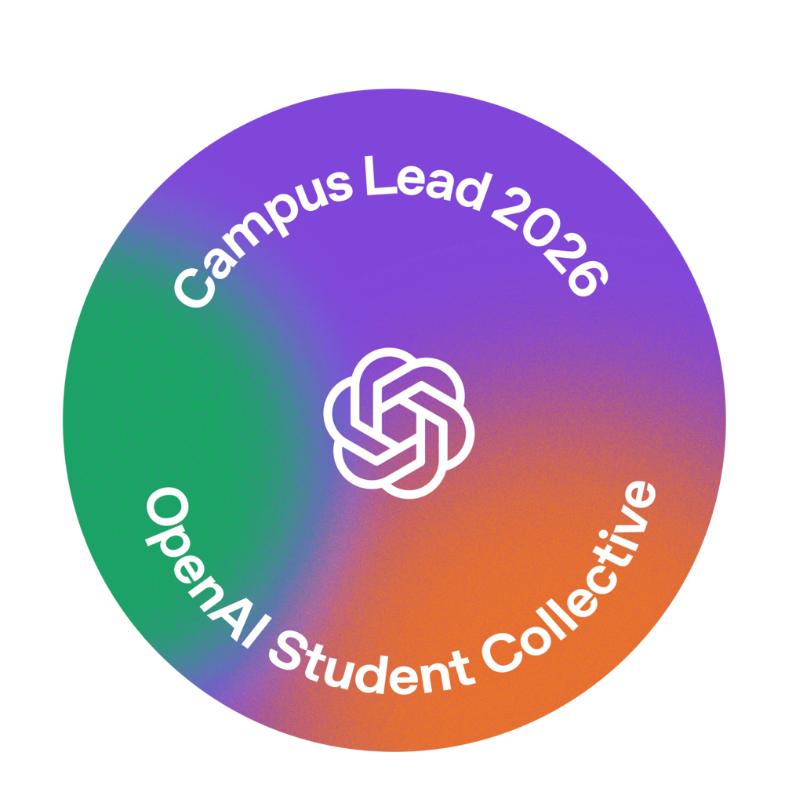

# 宮脇蒼空 / Sora Miyawaki

横浜国立大学の物理工学EPに所属しています。2026年9月、学生のAI活用を支援するOpenAI Student CollectiveのCampus Leadに選ばれました。プログラミングサークル「Lumos」に所属しています。

### 制作・参加プロジェクト

- [Assignment-Manager-for-YNU-LMS](https://github.com/Lumos-Programming/Assignment-Manager-for-YNU-LMS)  
  Lumosで開発している、横浜国立大学向けの課題管理ブラウザ拡張。開発に参加しています。

- DiscordのAIボット  
  会話の流れを踏まえて返答するボットを制作・改善しています。

- ゲーム・3D制作  
  Unreal Engineを使ったゲームの試作や、キャラクターの動きの制作に取り組んでいます。

- 学内プロジェクト  
  学内の関係者と協力して進めるプロジェクトにも参加しています。

[LinkedIn](https://www.linkedin.com/in/sora-miyawaki-a5b848433/)
